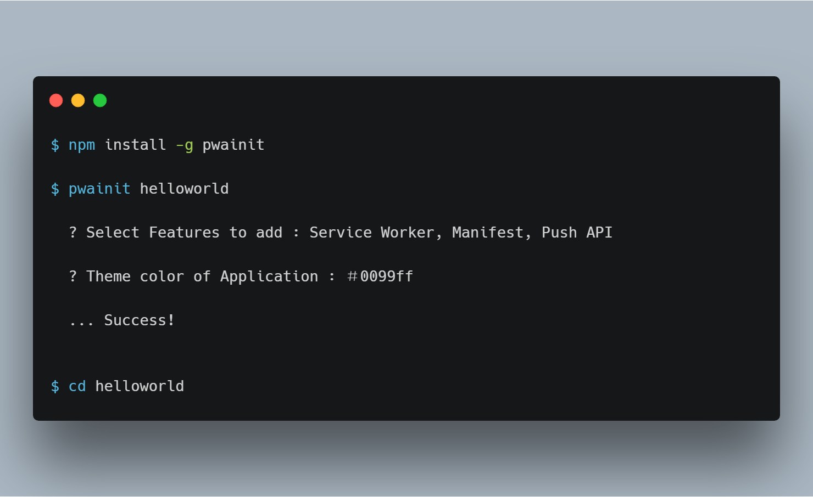
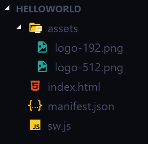

# PWAinit Documentation
Initiate PWA project and get boilerplate code for Progressive Web App features or Turn your existing website into Progressive Web App with `npm i -g pwainit` 🎉

PWAinit lets you intialize your PWA development process without writing basic service worker, manifest and index code.

 
 

## Table of Content
- [Installation and Usage](#installation-and-usage)
    - [Initiate new PWA project](#initiate-new-pwa-project)
    - [Turn Existing Website to PWA](#turn-existing-website-to-pwa)
- [What after pwainit?](#what-after-pwainit)
    - [Setup](#setup)
- [Debug](#debug)
- [Furthur Development](#furthur-development)
    - [Service Worker](#service-worker)
    - [Manifest](#manifest)
    - [Push API](#push-api)
- [References](#references)

## Installation and Usage
#### ▸ Initiate new PWA project
- `npm i -g pwainit`
- `pwainit <projectName>`  

**or**

#### ▸ Turn existing website to PWA
- `cd existingWebsite` 
- `pwainit .`

You can read my Medium article of [Turning your existing website to PWA using pwainit](https://medium.com/@saurabhdaware/turning-your-existing-website-to-pwa-using-pwainit-8c56c42abc4e) where I explained the steps in details

## What after pwainit?
- After completing above steps you will get files in following structure

***Note :*** Service worker does not work over file:// protocol thus you will need http://localhost to test the service worker. You can do this using `npm i -g serve` and `serve <project name>`

### Setup

#### ▸ For Push API
- Push API requires vapid which is provided by clouse messaging service(e.g. Firebase) or could be generated from backend. 
- If you are using Firebase then change the value of `const firbaseWebPushKey = < Firebase Web Push Certificate Key >` with your Web Push Key.
- Here's how to generate Web Push Key on Firebase : [https://firebase.google.com/docs/cloud-messaging/js/client#configure_web_credentials_with_fcm](https://firebase.google.com/docs/cloud-messaging/js/client#configure_web_credentials_with_fcm)
- If you are not using Firebase then refer :
[https://developers.google.com/web/ilt/pwa/introduction-to-push-notifications#identifying_your_service_with_vapid_auth](https://developers.google.com/web/ilt/pwa/introduction-to-push-notifications#identifying_your_service_with_vapid_auth)

#### ▸ For Service Worker and Manifest
They do not require any additional configuration to work however you can add your extra files to the `urlsToCache[]` array in sw.js to make them work offline

## Debug
- Open developer tools, Application -> Service Worker to see active Service Worker and Application -> Manifest to see manifest settings.
- If you choose Push API feature you will have to replace value of `< Firebase Web Push Certificate Key >` with your firebase web push key or a key generated from your backend. Read [Firebase Cloud Messaging Docs](https://firebase.google.com/docs/cloud-messaging/js/client#configure_web_credentials_with_fcm) to know how to get web push key on firebase
- You can check push notification by going to Developer tools -> Application -> Service Worker in the Push textbox type `{"title":"Hi I am title","body":"and I am body"}` and hit push button.

## Furthur Development
#### Service Worker
By default service worker code includes offline caching of files `assets/logo-192.png` and `index.html` whatever files you want to load offline should be added inside `var urlsToCache = []` array in sw.js file

#### Manifest
Manifest.json is the configuration file of your PWA. You can change theme color, name, short_name and initial logos from manifest file.

#### Push API
If you select Push API feature you will get code to subscribe user (You will have to add your VAPID for it to work as mentioned in [setup](#for-push-api)) which will return subscription object. This object should be passed to your backend and the endpoint should be used to Push Notification to the user.

Read the [Push API Backend Docs](https://developers.google.com/web/ilt/pwa/introduction-to-push-notifications#working_with_data_payloads) to understand the backend code of Push API

## References
- [Manifest Docs](https://developers.google.com/web/fundamentals/web-app-manifest/)
- [Service Worker Docs](https://developers.google.com/web/fundamentals/primers/service-workers/) 
- [Push API Docs](https://developers.google.com/web/ilt/pwa/introduction-to-push-notifications)
- [Firebase Cloud Messaging Docs](https://firebase.google.com/docs/cloud-messaging/js/client#configure_web_credentials_with_fcm)
- [Push API Backend Docs](https://developers.google.com/web/ilt/pwa/introduction-to-push-notifications#working_with_data_payloads)

## Contribution 

- This project is open for contributions you can pick up a task from [Issues](https://github.com/saurabhdaware/pwainit/issues) or Work on a new feature.
- Read [CONTRIBUTING.md](http://github.com/saurabhdaware/pwainit/blob/master/CONTRIBUTING.md) for complete guide of Contribution and Local Development.

***Thanks for reading! Dont forget to star the [Repository](https://github.com/saurabhdaware) 🎉***

